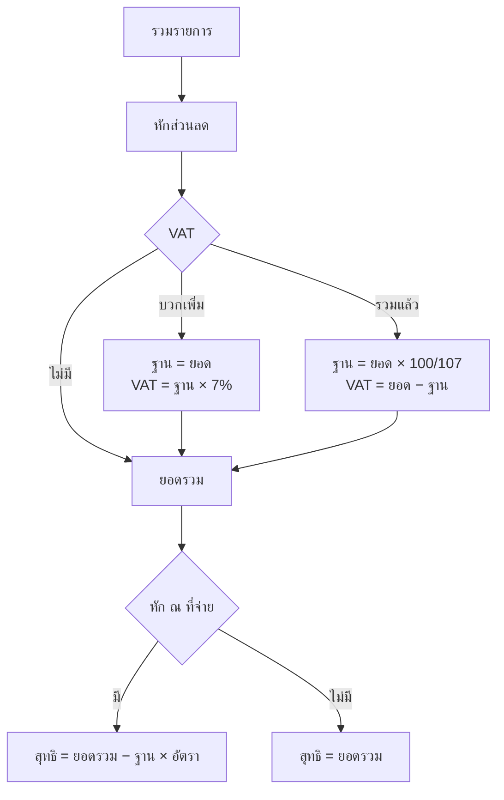

# 🧾 KANAO Thai Receipt

[](https://github.com/adisorn6302565/KANAO-Thai-Receipt/actions/workflows/pages.yml)


ออกใบเสร็จรับเงิน / ใบกำกับภาษี / ใบแจ้งหนี้ / ใบเสนอราคา เป็น PDF ขนาด A4 มีจำนวนเงินเป็นตัวหนังสือไทย และ QR พร้อมเพย์สำหรับให้ลูกค้าสแกนจ่าย เหมาะกับร้านเล็กและฟรีแลนซ์
**ทำงานในเบราว์เซอร์ทั้งหมด ไม่มี server ข้อมูลลูกค้าไม่ออกจากเครื่อง**

## 🌐 ใช้งานออนไลน์

**https://adisorn6302565.github.io/KANAO-Thai-Receipt/**

1. กรอกข้อมูลร้าน (จำไว้ในเครื่องอัตโนมัติ ครั้งต่อไปไม่ต้องกรอกใหม่)
2. กรอกลูกค้าและรายการ เอกสารด้านขวาอัปเดตทันที
3. กด **พิมพ์ / บันทึก PDF** → เลือกเครื่องพิมพ์ **Save as PDF / Microsoft Print to PDF**
   ชื่อไฟล์ตั้งให้เป็น `เลขที่เอกสาร ชื่อลูกค้า` อัตโนมัติ

## ✨ ฟีเจอร์

| | |
|---|---|
| เอกสาร 4 แบบ | ใบเสร็จรับเงิน, ใบกำกับภาษี/ใบเสร็จรับเงิน, ใบแจ้งหนี้, ใบเสนอราคา + ระบุต้นฉบับ/สำเนา |
| เลขที่อัตโนมัติ | `RE202609-0001`, `TI…`, `IV…`, `QT…` แยกตามประเภทและเดือน |
| ภาษี | VAT 7% บวกเพิ่ม หรือรวมในราคา, หัก ณ ที่จ่าย 1 / 2 / 3 / 5%, ส่วนลด |
| ตัวหนังสือไทย | `10,700.00` → "หนึ่งหมื่นเจ็ดร้อยบาทถ้วน" (รองรับเอ็ด / ยี่ / ล้านซ้อน / สตางค์) |
| QR พร้อมเพย์ | ใส่เบอร์พร้อมเพย์ร้าน → QR ยอดสุทธิขึ้นท้ายเอกสาร (ไม่แสดงในใบเสนอราคา) |
| ประวัติ | เก็บเอกสารในเครื่อง เปิดกลับมาแก้ / พิมพ์ซ้ำได้, สำรองและนำเข้าเป็นไฟล์ JSON |

> ประวัติเก็บใน `localStorage` ของเบราว์เซอร์ ถ้าล้างข้อมูลเบราว์เซอร์จะหาย ควรกด **สำรอง (JSON)** เป็นระยะ

## 🧮 การคำนวณ



หัก ณ ที่จ่ายคิดจาก **มูลค่าก่อน VAT** ตามหลักสรรพากร ส่วนตัวหนังสือในเอกสารคือ **ยอดรวมทั้งสิ้น** (ก่อนหัก ณ ที่จ่าย)

## 💻 รันในเครื่อง

ต้องมี [Node.js 22+](https://nodejs.org/)

```bash
npm install
npm run dev      # เปิดเว็บทดสอบ
npm test         # ทดสอบตัวหนังสือไทย + การคำนวณภาษี
npm run build    # ไฟล์ static ใน dist/
```

**Deploy:** push เข้า `main` → GitHub Actions รันเทสต์ build แล้วขึ้น GitHub Pages อัตโนมัติ

```text
src/
├── bahttext.ts     # จำนวนเงิน → ตัวหนังสือไทย
├── calc.ts         # ส่วนลด / VAT / หัก ณ ที่จ่าย
├── promptpay.ts    # payload QR พร้อมเพย์ (ใช้ร่วมกับ KANAO PromptPay QR)
├── main.ts         # ฟอร์ม + ตัวอย่างเอกสาร + ประวัติ
└── style.css       # หน้าจอ + รูปแบบ A4 สำหรับพิมพ์
```
